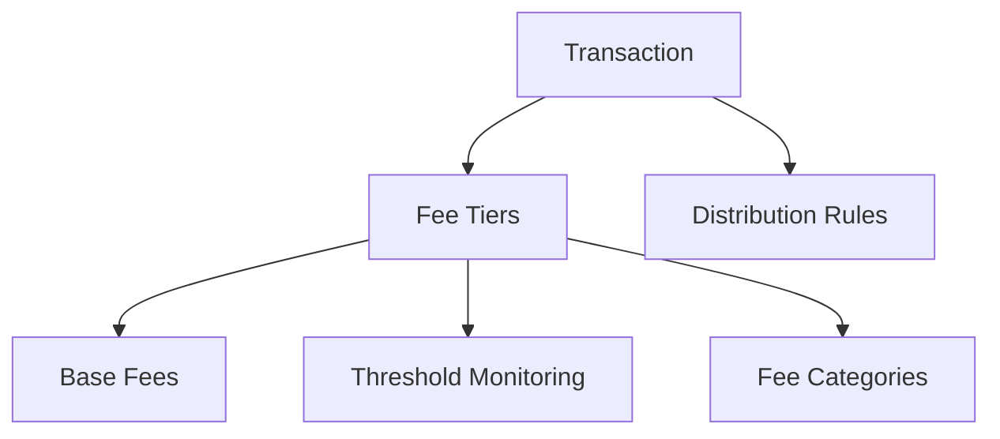

# Multi-Fee Transaction Tracker

A comprehensive Clarity smart contract for managing complex fee structures, transaction tracking, and transparent financial allocation across blockchain ecosystems.

## Overview

Multi-Fee Transaction Tracker empowers users to:
- Define flexible fee tiers and structures
- Track transaction fees across multiple dimensions
- Allocate fee distributions with precision
- Monitor fee-related thresholds and events
- Maintain immutable financial records
- Generate comprehensive fee analytics

## Architecture

The system is built around dynamic fee management, allowing complex fee tracking and distribution mechanisms. Each transaction can be associated with multiple fee types, categories, and allocation rules.



### Core Components:
- **Transactions**: Individual financial events with fee metadata
- **Fee Tiers**: Configurable fee structures with dynamic rates
- **Distribution**: Rules for allocating fees across stakeholders
- **Monitoring**: Threshold tracking for fee-related events
- **History**: Immutable record of transaction fees
- **Categories**: User-defined fee classification systems

## Contract Documentation

### Main Contract: fee-tracker.clar

The primary contract that handles comprehensive fee tracking and management functionality.

#### Key Data Structures:
- `transactions`: Records transaction fee details
- `fee-tiers`: Defines configurable fee structures
- `fee-history`: Tracks historical fee allocations
- `distribution-rules`: Manages fee distribution logic
- `fee-categories`: User-defined fee classifications
- `monitoring-thresholds`: Fee-related event tracking

## Getting Started

### Prerequisites
- Clarinet CLI
- Stacks wallet for deployment

### Basic Usage

1. Create a vault:
```clarity
(contract-call? .vault-pulse set-vault-info "My Portfolio" false)
```

2. Register an asset:
```clarity
(contract-call? .vault-pulse register-asset 
    "asset123" 
    "Bitcoin Holdings" 
    "Cryptocurrency" 
    u1635724800 
    u50000 
    u55000 
    none 
    false)
```

3. Update asset value:
```clarity
(contract-call? .vault-pulse update-asset-value "asset123" u60000)
```

## Function Reference

### Asset Management

#### register-asset
```clarity
(register-asset 
    (asset-id (string-ascii 36))
    (name (string-utf8 100))
    (category (string-ascii 50))
    (acquisition-date uint)
    (acquisition-cost uint)
    (current-value uint)
    (metadata (optional (string-utf8 1000)))
    (public-view bool))
```

#### update-asset-value
```clarity
(update-asset-value (asset-id (string-ascii 36)) (new-value uint))
```

### Access Control

#### authorize-viewer
```clarity
(authorize-viewer (viewer principal) (expiration (optional uint)))
```

#### revoke-viewer
```clarity
(revoke-viewer (viewer principal))
```

### Monitoring

#### set-threshold
```clarity
(set-threshold
    (asset-id (string-ascii 36))
    (threshold-id (string-ascii 36))
    (comparison (string-ascii 2))
    (value uint)
    (description (optional (string-utf8 200))))
```

## Development

### Local Testing

1. Initialize project:
```bash
clarinet new vaultpulse
```

2. Run tests:
```bash
clarinet test
```

3. Start local chain:
```bash
clarinet console
```

## Security Considerations

### Access Control
- All asset operations require owner authentication
- Viewer access can be time-limited
- Public visibility is configurable per asset

### Data Privacy
- Asset details are only visible to authorized parties
- Historical records are immutable once created
- Metadata can be optionally included or excluded

### Limitations
- No support for fractional ownership
- Asset values must be represented as integers
- Threshold monitoring requires external triggers

### Best Practices
- Regularly review authorized viewers
- Set expiration dates for temporary access
- Keep sensitive details in metadata optional
- Validate all inputs before transactions